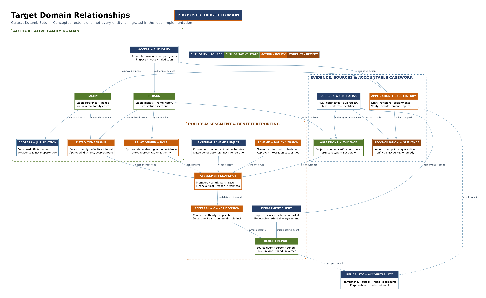

# Database design — Gujarat Kutumb Setu

This document distinguishes the **executable local schema** from the **complete target domain model** needed by the SRS. The executable authority is the SQLAlchemy model and Alembic migrations under `backend/`; proposed target entities below are not a claim that every government integration is already built. The user-approved name is used; all installed demo records are synthetic.

## 1. Modeling invariants

| Invariant | Why it changes the database design |
|---|---|
| Account ≠ person ≠ family ≠ application | One contact channel may be shared. A saved or submitted form is not an approved registry identity. Account recovery must not renumber a person. |
| Person remains stable through household change | A transfer ends one membership and starts another; a split does not create new copies of every person or erase their certificates. |
| Family membership is dated and source-aware | Record effective dates separately from transaction timestamps. Historical queries need the family composition at assessment time, not today's list. |
| Representative is a role | Current representative is convenient as a projection; production role/authority history must be independently retained. A representative does not automatically inherit authority over every adult's private facts. |
| PDS is an external authority | Its ration identifier is a typed source alias, not necessarily the public Gujarat ID. Reissue/cancellation must not silently destroy registry history. |
| Facts have subject, source and verification | Person caste/certificate, family address and scheme eligibility are not interchangeable fields. Unknown, declared, verified, disputed and revoked are different states. |
| Scheme-defined unit may differ from registry family | Store assessment/member/contributor snapshots and rule version, including permitted subfamilies. Never assume every household adult contributes to a pension's income calculation. |
| Commands retain history | Approval/rejection/change/appeal record actor, reason, policy and transition. Ordinary lifecycle actions do not hard-delete identity rows. |
| Registry ≠ payment ledger | A reported benefit belongs to a source, named subject, scheme, period and event. Missing reports do not establish nonpayment/ineligibility. |
| Source protection reaches the database | Foreign keys, uniqueness and appropriate checks enforce invariants even when several workers/API replicas act concurrently. |

PostgreSQL documents that cross-row guarantees require mechanisms such as `UNIQUE`, foreign keys or exclusion constraints; a `CHECK` must not be used as if it safely queried every other row. [PostgreSQL constraints](https://www.postgresql.org/docs/current/ddl-constraints.html)

## 2. Shared column conventions

- Opaque UUID primary keys; public Family/member/application references are distinct unique strings, not encoded birth date, caste, phone, district or other personal attributes. Demo references remain recognizable as synthetic.
- `created_at`, `updated_at`, event/recorded timestamps: UTC instants. Birth/effective/assessment dates: date-only values. No conversion of a birth date through UTC midnight.
- `revision`: integer compare-and-swap token for mutable resources. A stale client must receive conflict, not overwrite a newer fact. Revision alone does not replace transaction locks and constraints.
- `valid_from` / `valid_to`: half-open effective interval `[from, to)` where used; null end means current. `recorded_at` is when the system learned the assertion. Corrected backdated facts must preserve former recorded state.
- String identifiers preserve leading zeroes. Monetary values use exact decimal or integer minor units plus currency; in-kind quantity has a separate unit and cannot be summed into rupees.
- JSON is appropriate for versioned intake payloads, evidence metadata and minimum event payloads. It must not replace normalized canonical person/membership or source uniqueness. Reject unapproved/protected keys before persistence.
- User-supplied names support Unicode and source-script spelling. Do not infer surname, relationships, category or sex from a name.
- Retention periods are configurable policy choices, not arbitrary constants inferred from another state. Backups/audit have separate schedules from operational drafts.

## 3. Local executable model

The local schema deliberately implements the first end-to-end demonstration slice using normalized identities and transactional casework. See the generated [local ERD](graphs/local-erd.png) ([SVG](graphs/local-erd.svg)). Consult [implementation coverage](IMPLEMENTATION_COVERAGE.md) for delivered behavior and remaining production controls.

The local data dictionary is maintained alongside the model during implementation; the implementation contract identifies these resource groups:

| Group | Stored objects and relationships | Local boundary |
|---|---|---|
| Access | User, hashed staff/test credentials, provider-mapped authentication identifiers, expiring one-time challenges and server sessions. | Resident Family ID/mobile → OTP uses the simulated provider; staff sign-in is separate. Not government identity assurance. |
| Intake | Application belongs to an applicant; application transition/evidence children; optional resulting/affected family. | Saved payload can be incomplete; submission is server-validated. |
| Registry | Family, independent person and membership join; family address and representative; external aliases as implemented. | No universal caste/bank/medical profile. |
| Casework | Typed change applications and grievance cases/responses. | Only supported changes execute; unsupported transfer/split/merge are not silently accepted. |
| Schemes | Scheme catalogue, resident referral and source-reported benefit linked to an authorized person. | Real catalogue entries are information/external routes; connected scheme is labeled DEMO. |
| Governance | Versioned content, integration client request/scopes/credential hash, access/audit and outbox/notification records. | Current app audit is not an independently immutable archive. |

### Local physical-table inventory

Reviewed against `backend/app/models.py`. All IDs below are internal unless explicitly called public/reference. Application/entity snapshots are JSON; canonical people and memberships are not embedded only inside a household document.

| Tables | Main keys / actual local constraints | Important limitation |
|---|---|---|
| `users`, `auth_sessions` | Unique email; nullable unique person link; checked fixed role; session token digest PK, user FK, expiry/revocation. | Email is an internal staff/test account identifier, not the resident frontend's required entry method. |
| `auth_identifiers`, `auth_challenges` | Provider identifier→user mapping; opaque challenge, hashed OTP, purpose, expiry/attempt/consumption state. | Test identifier mapping is not a complete legal shared-phone identity policy. |
| `persons`, `families` | Separate PKs, unique public IDs, revisions; person DOB/life status and family address/district. | DOB exactness required by local test policy; approved estimated/unknown-age flow is target work. |
| `memberships`, `representatives` | Person/family FKs and start/end; partial unique active person membership and active family representative. Membership interval check. | Current uniqueness does not prove every historical overlap impossible; full transfer history needs additional exclusion/authority logic. |
| `representations` | Guardian/represented person FKs, unique pair, basis, expiry, active state. | Seeded reviewed minor authority is not comprehensive production guardianship adjudication. |
| `applications`, `application_events` | Owner/submitter/result family/verifier/approver FKs; unique nullable reference, revision, family revision, policy/channel; transition snapshots. | Complete independent assignment/appeal authority model remains target work. |
| `fact_history`, `evidence` | Fact links family/person/application, old/new/source/effective/recorded values; evidence owner/case, unique storage key and content hash. | File quarantine is not malware scanning or official source verification. |
| `schemes`, `scheme_applications` | Unique scheme slug; bilingual source/capability; referral owner/person/scheme FKs; unique owner+scheme in this test model. | A one-referral-per-scheme uniqueness rule is a simulator simplification, not every annual/recurring real scheme's rule. |
| `benefits` | Person/scheme/source-client FKs; unique department+source reference; exact `NUMERIC(14,2)` amounts/quantities, period and state. | Full correction/reversal linkage and scheme-specific award interactions need target model/extensions. |
| `payment_scopes`, `payment_orders`, `payment_events` | Staff-user+scheme grant; one payment order per scheme application; positive exact amount, permitted state check, unique provider reference; actor/action/from/to event history. Defined in `backend/app/payments.py`. | Simulated provider only: real settlement/callback mandate and reconciliation require a separate implementation; arbitrary test amounts are not official scheme amounts. |
| `grievances` | Owner/application FK, reference, jurisdiction, response and history/revision. | No claim of integration with an official Gujarat grievance authority. |
| `content_pages`, `content_versions` | Slug key, revision; immutable snapshot row per unique slug+revision with actor FK. | Snapshot retention is not a complete four-eyes publication/translation approval workflow. |
| `integration_clients` | Owner FK, requested/approved scopes, scheme allowlist, district, credential digest, expiry/status. | Real government trust, contracts and key issuance remain approval-gated. |
| `notifications`, `audit_events` | Recipient/subject user links; audit actor, purpose/object, event hash and time. | Per-event SHA-256 can detect accidental change only with a trusted reference; privileged rewriting needs independent anchored audit controls. |
| `outbox_events`, `event_deliveries` | Event/aggregate, attempts, due time/status; unique delivery per event to the local sink. | Multiple external subscribers require per-consumer delivery uniqueness and actual acknowledgments. |
| `idempotency_records`, `rate_buckets` | Unique actor+operation+key with request digest/result; keyed bounded-window counter. | Define retention/cleanup and multi-instance abuse policy before public deployment. |

### 3.1 Canonical enrollment transaction

The draft application owns proposed member data until approval. Final approval creates or links the canonical family/person/membership set only after authorized review. It records a distinct approval event and implementation outcome, issues the synthetic public ID once, links the application to that family, and commits audit/outbox together. Rejecting a draft/submission creates no approved family.

Replayed submission or decision must resolve the same intent. A changed payload using the same idempotency key is a conflict. A database uniqueness condition and transaction make two concurrent approvals unable to generate two families for one application; testing only a disabled submit button is insufficient.

### 3.2 Membership and change transaction

For address/name/add-member/death/representative changes supported by the demo: keep the proposed payload in a change application, verify and approve it, then mutate current registry projection and preserve reason/history. `pending` or `rejected` changes must not alter current family views. Deceased status is not a hard deletion and does not automatically stop reported benefits.

A production transfer additionally requires both source/destination authority, stable person matching, effective interval validation and ordered locks on both families/person. Do not implement it as `UPDATE person.family_id = ...` without dated membership history.

## 4. Complete target logical model

This is the normalized **target design** for all FR groups, not a promise that every table is migrated in this local release. Names are conceptual until their owning module's migration is approved. New tables extend stable identifiers rather than requiring wholesale person/family rewrites.

[Vector](graphs/target-domain-erd.svg) · [Editable Graphviz](graphs/target-domain-erd.dot)

### 4.1 Identity, relationships and geography

| Entity | Key attributes / keys | Relationships and invariant |
|---|---|---|
| `person` | `id PK`, `public_reference UK`, source-script display name, life status, revision | Independent of login and current family. Birth date may be supported/estimated/unknown under policy. |
| `person_name` | `id PK`, `person_id FK`, name/script/type, source/assertion, valid interval | Multiple historical spellings/transliterations without destructive normalization. |
| `family` | `id PK`, `public_reference UK`, lifecycle status, creation/closure reason, revision | No demographic meaning encoded in reference. No family-wide caste. |
| `membership` | `id PK`, `person_id FK`, `family_id FK`, status, valid interval, source/change reference | Current approved membership policy enforced; historical records retained. Source-conflicting claims stay outside approved membership until resolved. |
| `person_relationship` | `id PK`, two person FKs, relationship type, validity/evidence/status | Does not derive marriage/parentage from household position. Can be disputed. |
| `family_role` | `id PK`, `family_id FK`, `person_id FK`, role, interval, authority reference | Representative/guardian is time-bound and purpose-specific, not sole owner of all personal data. |
| `family_lineage` | predecessor/successor family FKs, action/case, effective date | Split/merge graph, no renumbering person; acyclic successor chain validated. |
| `jurisdiction` | `id PK`, official code/type/version, parent FK, valid interval | Import approved official codes; historical boundary versions survive district changes. |
| `address_assertion` | subject FK, structured address, jurisdiction FK, type, interval, source/verification | Property title/GPS not required by default. Multiple current-purpose addresses possible. |
| `contact_point` | `id PK`, value protected, kind, language, shared flag | **No global unique constraint on phone → person/family.** Channel verification and identity assurance separate. |
| `subject_contact` | person/family/account FK, contact FK, permitted purpose, period | Shared phones and safe-contact restrictions represented explicitly. |

### 4.2 Access, purpose and evidence

| Entity | Key attributes / keys | Relationships and invariant |
|---|---|---|
| `account` / `session` | account ID, auth provider/subject, status; session token digest, expiry/revocation | No raw long-lived session token at rest; optional person link does not grant all household authority. |
| `role_assignment` | account FK, role, jurisdiction/organisation, start/end, grant reason | Expiry and transfer revocation server-enforced. |
| `representation_grant` | representative and subject FKs, permitted operation/purpose, evidence, validity/status | Scope may cover a minor/case without covering other adults or unrelated benefits. |
| `notice_version` | type, locale, version, effective dates, approved content | Preserve notice shown at collection; translation versions tracked. |
| `authority_record` | actor/subject, operation, legal/administrative basis or consent, notice FK, timestamp/status | Consent is not a substitute for all lawful processing authority; withdrawal affects only applicable optional uses. |
| `source_system` | owner, purpose/agreement, allowed fields, cadence, retention, environment/status | Every adapter has an accountable source owner. |
| `external_alias` | source FK, subject type/FK, identifier type, protected identifier or keyed lookup digest, interval/status | Uniqueness scoped to source/type/time; reissued/conflicted aliases reviewed. Never public enumeration. |
| `fact_assertion` | subject type/FK, fact type/value, source/declarant, effective/recorded time, expiry, status | Preserve conflicting assertions; no last-write-wins certification. Separate typed views for restricted domains. |
| `evidence_object` | storage reference, hash, media type/size, subject, provenance, scan/review state | Protected storage; scanning is distinct from truth/issuer verification. No public stable download URL. |
| `assertion_evidence` | assertion FK, evidence FK, purpose/status | Reuse only when authorized/current, not every department's full document. |
| `certificate_reference` | holder person FK, issuer/type/reference, jurisdiction/list version, status/validity | Caste, NCL, income, EWS and domicile are independent types. |
| `reference_list_version` / `list_entry` | owner/instrument, version/effectivity, category, aliases, geography qualifiers | Updates cannot silently rewrite past certificates or decisions. |

### 4.3 Application and review

| Entity | Key attributes / keys | Relationships and invariant |
|---|---|---|
| `application` | applicant/acting authority, kind, branch, policy/schema version, state, revision, reference | Separate saved draft from submitted receipt and family identity. |
| `application_revision` | application FK, revision UK within application, immutable proposed payload, recorded time | Submitted historical snapshots preserved through corrections/resubmission. |
| `case_assignment` | application FK, assignee/role/jurisdiction, interval, reason | Assignment/reassignment is auditable and expires. |
| `case_transition` | case FK, from/to, action, actor, reason, policy, evidence revision, time | Append-only business history; invalid transitions fail atomically. |
| `verification_result` | case/member/assertion, verifier, result, method, evidence, time | Verified member data remains separate from final family approval. |
| `decision` | case FK, deciding authority, outcome/reasons, policy, effective date, previous decision | Separation of duties, review and appeal preserved. |
| `change_proposal` | application FK, affected subjects/facts, before/proposed value, source owner, effective date | Approved and implemented are distinct until the registry/source acknowledgment succeeds. |
| `grievance` / `correspondence` | requester, protected category, linked case/source txn, state/owner, response history | No permanent Family ID required; accused operator cannot suppress own complaint. |
| `import_run` / `import_item` | source/run/event identifiers, schema, counts, checkpoint, quarantine/error | Idempotent ingest, replay, reconciliation and source freshness. |
| `discrepancy_case` | source/assertions/subjects, matching confidence, owner, outcome/appeal | Duplicate candidates are not automatically merged or marked fraudulent. |

### 4.4 Schemes and reported outcomes

| Entity | Key attributes / keys | Relationships and invariant |
|---|---|---|
| `department` / `integration_client` | owner/purpose/agreement, approved scopes, status, credential digest/expiry | Client identity alone does not authorize every family or scheme. |
| `scheme` | owner, bilingual content, source/capabilities, status and review date | Catalogue-listed, discovery-enabled, referral-enabled and reporting-enabled are separate capabilities. |
| `scheme_policy_version` | scheme FK, rule/version/effective range, authority instrument, unit, required facts | Final legal decision power only when explicitly delegated. |
| `scheme_assessment` | scheme/policy FK, subject, assessment date, facts/freshness, outcome/reasons | Reproducible candidate, not automatically a sanctioned benefit. |
| `assessment_member` | assessment FK, person FK, role `assessed`/`contributor`/`dependent`, relation evidence, period | Preserve scheme-specific subfamily and income-year snapshot. |
| `external_subject` / `subject_role` | source/type/protected reference; person relation/validity/evidence | Utility connection/parcel/animal/enterprise stays owned by its issuing authority. No inferred title from household membership. |
| `scheme_referral` | assessment/applicant/authority, source/department reference, stage, event times | Contact/consent/referral/application/decision are separate stages. |
| `scheme_decision` | referral/external case FK, owner decision ID, state/reason, policy/period | Department-owned sanction/rejection, appeal retained. |
| `benefit_report` | source/client, `source_event_id`, subject/scheme, type/state, money or quantity, period/event time | Unique `(source, source_event_id)`; correction/reversal links predecessor; never mutate a payment ledger locally. |
| `benefit_interaction` | scheme/policy pair, compatible/exclusive/offset, period, owner | No universal rule that two pensions are duplicates. |
| `disclosure_record` | requesting actor/client, subject, purpose, permitted fields, decision, time | Minimized resident access history and independent restricted audit views. |

### 4.5 Reliability, publishing and operation

| Entity | Important invariant |
|---|---|
| `idempotency_record` | Unique actor/client + operation + key; request digest, result reference/status and retention. Same key with different intent conflicts. |
| `outbox_event` / `event_delivery` | Domain event committed with state; per-consumer retry/acknowledgment, event version/aggregate sequence and minimum payload. |
| `inbox_receipt` | Unique consumer/source event deduplicates deliveries; side effect and receipt share a transaction. |
| `notification` | User/channel/template/version/status; minimal content, actual delivery state, safe-contact basis. |
| `audit_event` | Actor/purpose/action/object/time/outcome and correlation; protected retention/export and independent integrity mechanism. |
| `content_item` / `content_version` | Locale, draft/review/approval/publication state, owner/source/review/expiry; immutable revisions. |
| `policy_configuration` | Scope/scenario/version/effective dates, approval and rollback; no arbitrary executable code accepted from editors. |
| `aggregate_release` | Measure, denominator, period/coverage, suppression policy, authorized publication version. Never called census population. |

## 5. Constraints, indexes and transaction plan

| Access/invariant | Required target mechanism |
|---|---|
| Resolve public Family ID | Unique B-tree on opaque public reference; authorize before returning an object. |
| Current membership | Partial unique index on approved current membership per person if the signed family definition requires one; full historic overlap prevention requires a dated exclusion constraint or serialized interval check. A current-row unique index alone does not prevent every historical overlap. |
| Membership interval | Check `valid_to IS NULL OR valid_to > valid_from`; source/target row locks plus exclusion where applicable. |
| Case queues | Composite indexes `(jurisdiction, status, submitted_at, id)` and owner `(applicant_id, updated_at, id)`; bounded/cursor pagination at scale. |
| Versioned edits | `UPDATE ... WHERE id=:id AND revision=:expected`; zero updated rows -> conflict. ORM versioning must not be bypassed by bulk writes. |
| Repeated source/report events | Unique source + external event; retain original payload digest to detect contradictory duplicates. |
| Pending worker items | Partial/composite index on state + next_attempt_at + created_at; bounded claims and recovery. |
| Audit/passbook query | Subject/source + time indexes; time partition when real volume justifies it, maintaining event uniqueness separately if necessary. |
| Scheme assessment | Unique policy + subject + assessment date/unit version for intended deduplication; add deliberate re-evaluation version for corrections. |
| Sensitive aliases | Use protected ciphertext and purpose-scoped keyed matching index when approved; never plain public full-text search across identifiers. |

No relational constraint should silently cascade-delete permanent people, families, decisions or audit history as a normal business action. Explicit draft/evidence expiration is a different controlled retention workflow, with legal-hold handling and deletion receipt where required.

## 6. Data protection, migration and recovery

The local demo relies on synthetic data and local access. Production storage encryption, key custody/rotation, restricted schemas/roles, evidence quarantine, secret management, protected backups and independent audit integrity require operational implementation, not merely a field named `encrypted`.

Use database migrations under version control. Upgrade a copied synthetic database before release; verify foreign keys, uniqueness, row counts and old-client compatibility. For real migration, keep immutable source crosswalks, quarantined errors, replay checkpoints and signed reconciliation totals. Add columns/tables compatibly, backfill in bounded batches, measure, switch reads, and only later retire old structures.

Backup restore is a separate test from schema migration. PostgreSQL WAL archiving plus a valid base backup supports point-in-time recovery when correctly configured; demonstrate restoration into an isolated instance and verify access/audit relationships. [PostgreSQL recovery documentation](https://www.postgresql.org/docs/current/continuous-archiving.html)

## 7. Acceptance assertions for DB correctness

1. Two concurrent approvals of one submitted application create exactly one resulting family and one set of person memberships.
2. Two residents sharing a phone can have separate accounts/cases; possession of that phone value alone discloses neither family's records.
3. Repeated submission with the same intent returns the same reference; contradictory reuse conflicts.
4. A pending/rejected change does not mutate the family; implemented change has linked actor/reason/events and revision advancement.
5. Deceased/member departure retains person/history; unrelated scheme reports are not automatically cancelled.
6. Transaction failure between family creation and outbox insertion leaves neither half committed.
7. Duplicate source benefit event cannot double the passbook; reversal is linked and not counted as another payment.
8. An account/role cannot retrieve a different adult's restricted records just by guessing IDs.
9. Worker restart recovers durable pending work and does not recreate delivered notification effects.
10. Target-only transfer/split/source-certificate rules remain disabled until interval, authority and historical-assessment tests exist.
