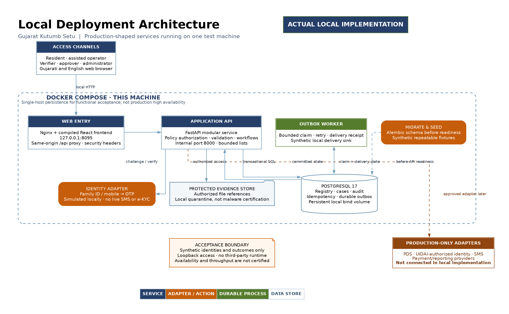
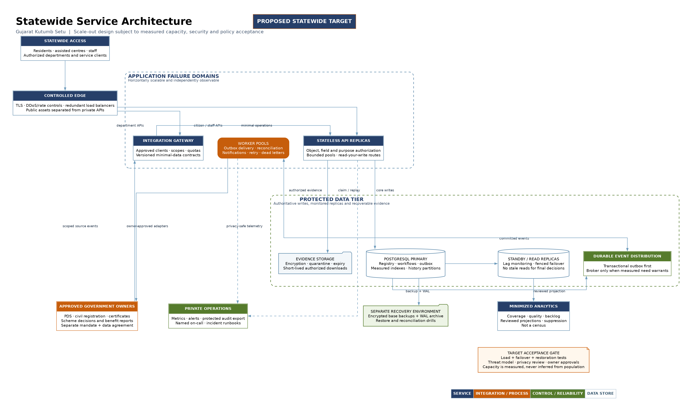

# Gujarat Kutumb Setu — system architecture

Status: intended production-shaped frontend and persistent local application using simulated providers, plus an explicit statewide target design. See [research decisions](RESEARCH_DECISIONS.md), [data model](DATABASE_DESIGN.md), [business operations](BUSINESS_RULES_AND_OPERATIONS.md) and [coverage](IMPLEMENTATION_COVERAGE.md). Population-wide production capability is **not proven by this local deployment**.

## 1. Delivery boundaries

The product is a governed family/person registry, citizen case-management surface and integration layer. It is not a new Aadhaar authority, certificate authority, payment switch, clinical record store, land title register or statutory census. Source owners remain accountable for source facts; scheme owners remain accountable for eligibility decisions and actual delivery/payment.

The local application demonstrates public information, bilingual resident access, synthetic enrollment and tracking, assigned staff decisions, a persistent registry, controlled corrections, grievance handling and scheme/benefit views to the extent recorded in the implementation coverage. Real external services are not called in order to make the demo appear operational.

## 2. Local topology

[Vector image](graphs/local-architecture.svg) · [Editable source](graphs/local-architecture.dot)

| Component | Responsibility | Boundary |
|---|---|---|
| Browser / React + TypeScript | Public shell, Gujarati/English, forms, resident/staff task views, API client, accessible feedback. | Never authoritative for permissions, identity or eligibility. Sensitive state stays in memory; durable drafts are server-side. |
| Nginx | Built frontend assets and same-origin reverse proxy to `/api`; bounded requests and protective headers. | Only intended published local entry port; production TLS is a separately configured gate. Private API responses must not be shared cached. |
| FastAPI | Authenticated use-case handlers, validation, authorization, workflow rules, audit, API schemas. | No direct browser DB access; no hidden mock fallback when the API fails. |
| PostgreSQL | Sessions, applications, people/families, dated membership, requests, schemes/benefits, audit/outbox and transaction integrity. | Persistent volume/bind mount is not a tested independent backup. DB has a diagnostic **loopback-only** host binding on 55432, not a public network binding. |
| Durable worker | Process pending outbox records into demo notifications/integration outcomes; record completion and retry status. | At-least-once pattern; external destinations require approved connectors and deduplication. |
| Migration/seed command | Apply versioned schema; insert explicitly synthetic repeatable demo fixtures. | Run before app readiness, not competitively from every API replica. Demo seeding disabled in a production profile. |

Compose is an orchestration convenience for one test host, not a replacement for multi-site high availability. Current local entry is **http://127.0.0.1:8095**; API port 8000 is internal. Existing unrelated services on 8080/8000/5173 are preserved. Native development can run the same frontend/API/database components without containers; the documented launch commands and actual compose files are the final port/service authority.

### 2.1 Identity and source adapter boundary

The intended resident frontend uses **Family ID/registered mobile → OTP → session**, with separate staff sign-in. An identity provider issues a server-side challenge containing an opaque ID, purpose, destination mask, expiry/resend policy and attempt state. Verification consumes that challenge and one-time code, then creates the normal protected session. The local provider returns synthetic delivery/verification; it is not live SMS or Aadhaar e-KYC. The frontend neither decides the OTP nor substitutes an email-led demo workflow.

`IDENTITY_PROVIDER=simulated` is an explicit local configuration. A production provider implementation must pass the same contract plus approved identity/authority/alternative-access controls. Merely changing an environment name without implementing that provider returns unavailable; it must not activate a hidden synthetic fallback. PDS/source/benefit adapters follow the same principle: normal service screens, persistent state, explicit coverage/provider metadata, no invented official eligibility or payment success.

## 3. Domain boundaries inside the backend

| Module | Commands and reads | Data it does not own |
|---|---|---|
| Access | Sign-in, sessions, actor role, expiry, logout, resident case ownership. | UIDAI identity records, universal guardianship judgments. |
| Intake | PDS-route selection, server drafts, submission receipt, validation and revision. | Food entitlement and authoritative ration corrections. |
| Registry | Stable person/family records, membership, representative, aliases and approved changes. | One family-wide caste or bank-account master. |
| Casework | Assignment, verification, clarification, approval/rejection, change/grievance processing. | Automatic award or unilateral revocation of another department's benefit. |
| Schemes | Public catalogue, bounded discovery, referral history, department-reported benefit views. | Payment execution, official category certification or inferred clinical diagnosis. |
| Integration | Scoped source adapters, outbox/inbox, reconciliation and owner freshness. | Blanket unrestricted access to all departments. |
| Accountability | Access/change events, reasons, source/actor metadata and operational measures. | A promise of cryptographic tamper-evidence unless separately implemented and verified. |

These boundaries are useful even while deployed together. Split a module into its own service only when measurements or governance require independent scaling, failure isolation or release ownership. Preserve API/event contracts and transaction invariants before extracting it.

## 4. Submission and decision transaction

1. Authorize the session and exact application. Validate the form-policy version, required synthetic declarations and input types.
2. Lock/revision-check the draft. Check submission idempotency within actor + operation scope.
3. Store submitted state, reference, immutable receipt/history, audit and outbox event in the **same transaction**.
4. Commit, then return success. If the response is lost, a retry resolves the existing submission rather than creating another family.
5. Staff verification records evidence outcome and reason. Final approval runs under a locked current case state and authorized approver.
6. Permanent family, person and membership records plus approval history/outbox commit together. No `approved` response before that transaction succeeds.

See the [workflow diagram](graphs/enrollment-review-flow.png) and [allowed-operation matrix](BUSINESS_RULES_AND_OPERATIONS.md). Short database transactions must not hold locks while waiting for SMS, a resident, a document upload or a department API. [PostgreSQL locking](https://www.postgresql.org/docs/current/explicit-locking.html)

## 5. Reliable integration

An outbox record stores event ID, type/version, aggregate reference, time, minimum authorized payload, destination/capability and delivery state. The worker claims bounded records, processes them and records outcome. Recovery must account for a crash before claim, after claim and after a remote side effect but before acknowledgment. Consumers deduplicate by event ID, and source imports deduplicate by `(source, source_event_id)`.

For a production connector add leases or transaction-scoped claims, exponential backoff with jitter, maximum attempt/age alerts, dead-letter review, replay authorization and reconciliation receipts. An acknowledgment means only what the contract says: transported, accepted by owner, applied, or rejected. Registry change `implemented` and departmental propagation `acknowledged` are distinct states.

Do not announce “exactly once.” A crash can cause redelivery even with a durable queue; use unique event IDs and idempotent receiver operations. Ordering is per family/person aggregate when necessary, not a globally serialized stream of all Gujarat activity. Out-of-order events use version/effective dates and conflict review instead of blindly overwriting later facts.

## 6. Statewide target topology — not installed by the demo

[Vector image](graphs/statewide-target-architecture.svg) · [Editable source](graphs/statewide-target-architecture.dot)

| Tier | Target evolution | Evidence required before enabling |
|---|---|---|
| Edge | State-approved TLS termination, redundant load balancers, request limits, DDoS controls; separate public assets from private APIs. | Certificate lifecycle, failure test, approved runtime origins and exposure review. |
| API | Multiple stateless replicas across failure domains; shared sessions/revocation state and bounded database pools. | Replica-loss test, consistent authorization and total connection-budget test. |
| Core DB | Primary plus standby with monitored replication, controlled failover/fencing; carefully scoped read replicas. | Conflict/retry tests, replica-lag handling, primary loss and restore drill. Read-your-write flows remain on primary. |
| History/event storage | Time-partitioned audit/outbox/benefit tables when justified; durable broker only if it improves measured operations. | Query plans, partition uniqueness design, retention/legal review and replay results. |
| Workers | Independently scaled notification, reconciliation and scheme tasks with fair quotas per department. | Poison message, connector outage, catch-up, backlog age and deduplication tests. |
| Documents | Approved encrypted object/file service with malware quarantine, permissions and lifecycle policy. | File-type/signature limits, content scanning, download authorization, restore and key rotation. |
| Integration gateway | Per-department client identity, scopes, purpose, mTLS/OAuth where agreed, signed contracts and rate quotas. | Object/field authorization, credential rotation, revocation and conformance testing. |
| Analytics | Minimized approved projections/replicas; suppression and denominators. | No unrestricted OLTP scans, no public personal lookup, no reconstruction of small cells. |
| Operations | Private metrics/logs/traces, immutable audit export, protected backups and separate disaster-recovery environment. | On-call ownership, privacy-safe logs, restore exercise and incident simulation. |

The AWS option maps these same responsibilities onto approved managed or self-managed infrastructure only after a government migration decision. Domain references and citizen IDs do not encode physical hosts. Storage adapters and configuration prevent provider URLs from becoming permanent identity keys. No AWS account, hosted service or paid resource is created by this repository.

## 7. Capacity model: estimates, not benchmark results

The SRS cites approximately 15.16 million Gujarat PDS cards and 65.44 million beneficiaries as a dated administrative planning reference, not census totals or an available import. Do not use them as an observed concurrent-user count. A conservative **planning example** is 20 million families and 100 million persons, followed by a 2× growth exercise; reconcile actual source coverage before procurement.

| Workload assumption | Derived engineering quantity | What must be measured |
|---|---|---|
| 10 million interactive sessions/day × 20 dynamic API calls | 200 million requests/day ≈ 2,315 average requests/s. At assumed 10× intraday burst: ≈ 23,150 requests/s. | Public/static-cache proportion, real journey call count, arrival distribution, p95/p99 and errors. These numbers are **illustrative**, not a committed SLA. |
| 1 million submissions/changes/day | ≈ 11.6 average commands/s; at assumed 20× burst ≈ 232 commands/s. | Write amplification, index/lock contention, duplicate checks and approval peaks. |
| 100 million people × 5 approved scheme assessments | 500 million assessments. Over 24h ≈ 5,787/s; over 7 days ≈ 827/s. | Evidence-fetch cost, scheme complexity, fair batching, checkpoint resume and source quotas. Do not synchronously evaluate every scheme on login. |
| 100 million person records × assumed 2KB logical row+fact baseline | ≈ 200GB decimal before indexes, history, WAL, bloat, replicas and backup copies. | Real sampled row widths and retention. This is not a total storage estimate. |
| 20 million applications × assumed 3 documents × 0.5MB | ≈ 30TB decimal if documents are actually necessary. | Document reuse, upload policy, compression, retention, scan cost and authorization; do not collect files solely to fill capacity. |
| 200 million permitted access events/day × assumed 300 bytes | ≈ 60GB/day before indexing, replicas and retention. | Whether every event must be retained at that detail, legal schedule, cryptographic export and approved minimization. |

Sizing formula: `peak concurrency ≈ arrival rate × response time` for a stable workload; concurrency does not equal population. Bound DB connections independently of HTTP concurrency. For example, 20 API replicas with 20 base + 10 overflow connections could demand 600 connections; worker/migration/admin reservations must fit the actual PostgreSQL budget. These are examples, not chosen production settings.

Partition only after observing large-table access/retention behavior. Mutable geographic membership makes district a poor permanent identity sharding key. Time-partition append-only histories first where appropriate; maintain global subject/event uniqueness deliberately. [PostgreSQL partitioning](https://www.postgresql.org/docs/current/ddl-partitioning.html)

## 8. Acceptance gates for scale and resilience

The companion proposes p95 registry lookup ≤2s, local submission acknowledgment ≤5s, 99.9% monthly core availability, RPO ≤15min and RTO ≤4h. They remain engineering targets until the owner accepts a measured workload and exclusions. **The single-host demo does not satisfy production NFR-04–06 by construction.**

Before statewide deployment collect:

1. Versioned infrastructure manifest, representative synthetic dataset (including skew/large families/history), workload mix, arrival rate, duration, query plans, CPU/memory/IO/network and report artifacts.
2. Baseline, peak, 2× spike and ≥8h soak tests with business correctness assertions. Measure p50/p95/p99, error rate, DB saturation, lock wait, pool wait, replica lag and queue age, not only HTTP 200 counts.
3. Concurrent approval/idempotency, duplicate benefit, contradictory transfer, source outage, stale event and retry tests; verify no duplicate ID or silent loss.
4. API replica termination, DB failover, worker crash after remote acceptance, unavailable storage/SMS/source and backlog-recovery exercises.
5. Full encrypted-backup and WAL restore into isolated infrastructure, checksum/row-count reconciliation, authentication/access verification and measured RPO/RTO. [PostgreSQL PITR](https://www.postgresql.org/docs/current/continuous-archiving.html)
6. Independent security, accessibility, source-owner conformance, production identity, lawful-data and incident-response gates; no claim that local synthetic tests establish these approvals.

## 9. Security and operational production gate

Use an explicit non-demo configuration, disable seeded credentials/OTP disclosure, configure HTTPS and Secure cookies, staff MFA, trusted reverse-proxy origins, CSRF protection, input/output limits, strict CORS/CSP, least-privilege DB roles and secrets supplied outside source control. Review uploads separately; a filename extension is not malware validation. Do not publicly expose API docs, metrics, database or operator tools without an approved need.

A protected application audit table is a useful demo record but not by itself tamper-evident against a database administrator. Production needs append-only permissions, independent protected export/signature/hash-chain design, key custody, verification jobs and retention policy. Deleting or restoring a database must not erase the only audit copy.

Observe request counts/duration, authorized failure reasons, queue ages, source freshness, DB pool/locks, backlog, backup age and deployment version. Do not put raw identifiers, request bodies, names, certificates or OTPs in standard application logs or metrics labels. Recovery runbooks identify owner, symptom, safe action, verification and escalation rather than assuming a dashboard guarantees reliability.

## 10. Rollout and migration

Local demo → isolated synthetic integration environment → approved small geographic/channel pilot → measured expansion → statewide operation. Each stage retains rollback and explicit enabled-capability lists. Expand/contract database migrations add nullable/new fields first, backfill with checkpoints, deploy compatible readers/writers, verify, then remove obsolete structures in a later release. Source-ID crosswalks and immutable person/family references survive all infrastructure migrations.

The NeGD example supports on-premise feasibility and progressive integration. It is not a sizing blueprint, legal authorization or proof that this implementation already meets Gujarat-wide demand. [NeGD UP precedent](https://negd.gov.in/isl/Directory/statedata/95)
